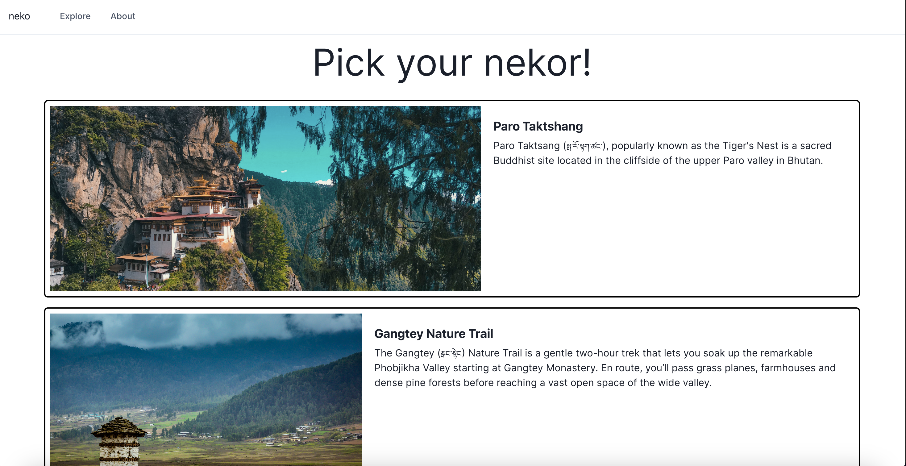

# Nekor

Nekor provides an immersive web experience to learn about sacred and historical sites across the himalayan region. This project won the first ever Global Tibetan Professionals Network North America Hackathon and here is the [devpost submission](https://devpost.com/software/neko).

The web app is built using the MERN stack developed using next js framework.

The inspiration for Neko came about from our childhood memories of going on a Nekor(གནས་སྐོར།) or pilgrimage with our grandparents to sacred sites in the himalayan region. A highlight was always hearing the stories and historical accounts of the place from the elders and we realized that with modernization, most of these stories were going to die with them so to address cultural preservation, we wanted to create a literal story map curated by elders and historians.

Each Nekor has a chosen route to follow which tracks the users location on the route and updates a progress bar of the journey in terms of distance covered. There are also a list of checkpoints each which when clicked shows a picture of the site and its significance. The types of checkpoints are cultural landmarks, natural landmarks and recommended rest stops.
